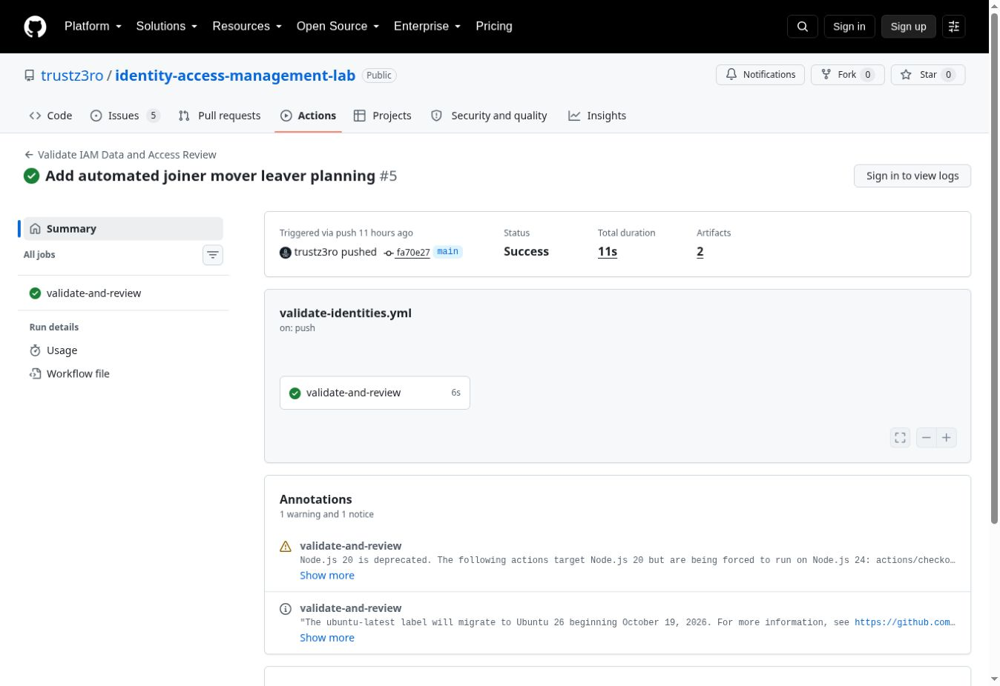

# IAM Lab Evidence Walkthrough

All names, approvals, and access records are fictional. The CSV files represent a simulated identity source and current group memberships; the outputs are review findings and **proposed** actions, not changes to a live directory.

## RBAC review: direct assignment and departing access

1. [`data/sample-users.csv`](../data/sample-users.csv) identifies Morgan Reed (`TZ1002`) as an active Security Analyst and Dakota James (`TZ1006`) as Departing.
2. [`data/rbac-roles.csv`](../data/rbac-roles.csv) defines approved groups for their job titles. [`data/group-memberships.csv`](../data/group-memberships.csv) represents current access and its assignment method.
3. [`scripts/python/generate_access_review.py`](../scripts/python/generate_access_review.py) compares the inputs and writes [`reports/access-review.csv`](../reports/access-review.csv). Morgan's `GG-Security-Log-Readers` assignment matches the role but is direct, so the row says `Modify`: replace it with a role-based assignment. Dakota still has Finance memberships despite a Departing status, so the row says `Revoke`.

The report contains four `Approve`, one `Modify`, and one `Revoke` decisions in the checked-in sample. These are generated recommendations; no memberships are modified by this script. See [access-review.md](../docs/access-review.md) for the other checks and decision rules.

## Lifecycle planning: joiner, mover, leaver

1. [`data/jml-events.csv`](../data/jml-events.csv) contains three sample events with effective dates and HR references.
2. [`scripts/python/generate_jml_plan.py`](../scripts/python/generate_jml_plan.py) validates those events against the identity and RBAC files and writes [`reports/jml-action-plan.csv`](../reports/jml-action-plan.csv).
3. `JML-002` plans Avery Collins's move from Help Desk Analyst to Security Analyst: remove `GG-HelpDesk-Analysts`, add the two Security groups, and update the department, title, and organizational unit. The plan calls for removing obsolete access before granting the new access. `JML-001` plans a new account; `JML-003` plans disabling a departing account and removing its groups.

All three sample rows are `Ready`. This status means their planning checks passed. Account creation, disablement, session revocation, and group changes remain to be implemented and verified in a future Active Directory phase. See [joiner-mover-leaver.md](../docs/joiner-mover-leaver.md).

## Continuous integration evidence

The [September 23 successful workflow run](https://github.com/trustz3ro/identity-access-management-lab/actions/runs/35866986539) at commit `fa70e27` shows the `validate-and-review` job succeeded and produced two artifacts (`access-review-report` and `jml-action-plan`). The [workflow configuration](../.github/workflows/validate-identities.yml) runs identity validation and both report generators on pushes and pull requests. GitHub retains the downloadable artifacts for 30 days; the checked-in CSV reports provide durable examples.

The screenshot captures the public run summary. GitHub's public view requests sign-in for detailed logs. The run showed a Node.js 20 deprecation warning for pinned Actions versions, despite succeeding; upgrading those Actions is a maintenance follow-up.

## Next hands-on evidence

After the Active Directory phase is built, capture screenshots of the OU and group structure, one joiner before and after, a mover's old groups removed before new groups are added, and a leaver's disabled account and removed memberships. For each, include the relevant fictional request ID, expected result, observed result, and date. Redact secrets and real infrastructure details.
